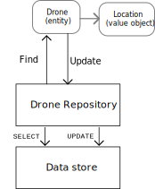

# API design for microservices

When you design APIs for a microservice, it's important to distinguish between two types of API:

- A public API that client applications call. 
- Backend APIs that are used for interservice communication.

These two use cases have somewhat different requirements. The public API must be compatible with client applications, typically browser applications or native mobile applications. Most of the time, that means the public API will be REST over HTTP. For the backend APIs, however, you need to take network performance into account. Depending on the granularity of your services, interservice communication can result in a lot of network traffic. Services can quickly become I/O bound. For that reason, considerations such as serialization speed and payload size become more important.

## Technology choices

You have to consider several aspects of how an API is implemented:

- **REST or RPC interface**. For a RESTful interface, the most common choice is REST over HTTP using JSON. For an RPC-style interface, there are several popular frameworks, including gRPC, Appache Avro, and Apache Thrift.  

- **Interface definition language (IDL)**. An IDL is used to define the methods, parameters, and return values of an API. An IDL can be used to generate client code, serialiation code, API documentation, or to run automated API tests. Frameworks such as gRPC, Avro, and Thrift define their own IDL specifications. REST over HTTP does not have a standard IDL format, but a common choice is OpenAPI (formerly Swagger). You can also create an HTTP REST API without using a formal defininition language, but then you lose the benefits of code generation and automated testing.

- **Serialization format**. This defines how are objects are serialized over the wire. Options include JSON and XML, which are text-based, or binary formats such as protocol buffer. 

In some cases, you can mix and match options. For example, by default gRPC uses protocol buffers for serialization, but it can use other formats such as JSON.

## Considerations

- Tradeoffs between a REST-style interface or an RPC-style interface.
- Does the serialization format require a fixed schema? If so, do you need to compile a schema file?
- Framework and language support. HTTP is supported in nearly every framework and language. gRPC, Avro, and Thrift all have libraries for C++, C#, Java, and Python. Thrift and gRPC also support Go. 
- Tooling for generating client code, serializer code, API documentation, etc. 
- Serialization efficiency in terms of speed, memory, and payload size.
-  If you are using a service mesh, is the protocol compatible? For example, linkerd has built-in support for gRPC.
- How will you version the APIs and data schemas?
- If you choose a protocol like gRPC, you may need a protocol translation layer between the public API and the back end. A gateway can perform that function.

Our recommendation is to choose REST over HTTP as a baseline, unless you need the performance of a binary protocol. REST over HTTP requires no special libraries. It creates minimal coupling, because callers don't need a client stub to communicate with the service. Finally, it's compatible with browser clients, so you don’t need a protocol translation layer between the client and the backend. However, if you choose this option, you should do performance and load testing early in the development process, to validate whether it performs well enough for your scenario.

## Designing RESTful APIs

- Promotes loose coupling between client and server.
- Enforces stateless communication, which improves scalability.
- Defines a uniform interface based on HTTP verbs, which encourages evolvability.

(See [Representational State Transfer (REST)](http://www.ics.uci.edu/~fielding/pubs/dissertation/rest_arch_style.htm) in *Architectural Styles and the Design of Network-based Software Architectures* by Roy Fielding)

In addition, we've seen how making an API resource-oriented maps well to the tactical DDD patterns of aggegates, entities, and value objects. See [Apply tactical DDD concepts](./tactical-ddd.md)

At this point, the principles of REST over HTTP are well-defined. You may find the following topics useful:

[API design](../best-practices/api-design.md) describes general best practices for designing and versioning a REST API. 
[API implementation](../best-practices/api-implementation.md) gives specific recommendations for implementing the API. 


### Asynchronous operations

### Throttling

### Resource conflicts

### Versioning

### OpenAPI documents

<!-- 
•	Give a few examples of best practices (action, error-code, async etc.)
•	Describe some key design decisions (handling Async requests, return 202)
•	Use query string for versioning because our URLs are expected to be stable
•	Use OpenAPI spec to authorize user access
•	Provide OpenAPI (Swagger) document for clients. Please refer to Benefit -> Easy Consumption from here https://pnp.visualstudio.com/_git/DroneDelivery?path=%2FREADME.md&version=GBfeature%2F5842_Delivery_Service_Messaging_choices&_a=preview
•	HATEOAS?
-->

## Mapping DDD patterns to REST

Patterns such as entity, aggregate, and value object are designed to place certain constraints on the objects in your domain model. For example, value objects are immutable. In many discussions of DDD, the patterns are modeled using OO language concepts like constructors or property getters and setters. 

For example, here is a TypeScript implementation of a value object. The properties are declared to be read-only, so the only way to modify a Location is to create a new one. The properties are validated when the object is created.

```ts
export class Location {
    readonly latitude: number;
    readonly longitude: number;
    readonly altitude: number;

    constructor(latitude: number, longitude: number, altitude: number) {
        if (latitude < -90 || latitude > 90) {
            throw new RangeError('latitude must be between -90 and 90');
        }
        if (longitude < -180 || longitude > 180) {
            throw new RangeError('longitude must be between -180 and 180');
        }
        this.latitude = latitude;
        this.longitude = longitude;
        this.altitude = altitude;
    }
}
```

Coding practices like this are particularly important in a more monolithic application. In a large code base, many subsystems might use the `Location` object, so it's important for the object to enforce correct behavior. 

Another example is the Repository, which ensures that other parts of the code cannot make arbitrary writes to the data store:



But in a microservices architecture, services don't share a code base and don't share data stores. Instead, they communicate through APIs. Consider the case where the Delivery Scheduler service requests information about a drone from the Drone Management service. The Drone Management service will have an internal model of a drone, which is represented in code. But the Delivery Scheduler doesn't see that. Instead, it receives a wire representation of the entity &mdash; for example, JSON in an HTTP response body.


As a result, code has a smaller surface area. If the Drone Management service defines a Location class, the scope of that class is limited to the service, making its easier to validate the correct usage. If another service needs to update the drone location, it has to go through the Drone Management service API.

It turns out that RESTful APIs can model many of the tactical DDD concepts.

- Business logic is encapsulated in the API, so the internal state of an aggregate is always consistent. Don't expose APIs that allow clients to manipulate internal state in an inconsistent way. Favor coarse-grained APIs that expose aggregates as resources.

- Aggregates are addressable by ID. Aggregates correspond to resources, and the URL is the stable identifier.

    ```    
    /api/orders/{id}
    ```
    
- Child entities can be navigated from the root, or via links in the representation (following HATEOS principles)

    ```    
    /api/orders/{id}/items/{order_item_id}
    ```    

- Value objects are updated by replacing the entire value through a PUT or PATCH request.

    ```    
    PUT /api/customer/{id}/address
    ```    

- A collection can act like a repository.

    ```    
    /api/users/{id}/orders/
    ```

In this guidance, we focus less on OO coding principles, and put more emphasis on API design.