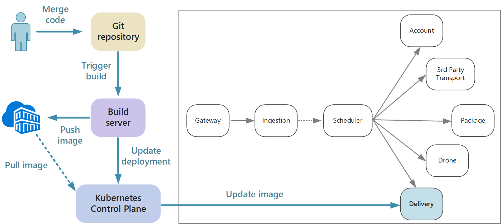

## Implementing CI/CD for microservices

Continuous integration and continuous deployment (CI/CD) are a key requirement for achieving success with microservices. Without a good CI/CD process, you will not achieve the agility that microservices promise. This section describes some of the challenges of CI/CD for microservices (multiple code bases, heterogenous build environments), along with a suggested approach.

One of the big reasons to adopt a microservices architecture is to enable faster release cycles, and the CI/CD process is critical to making that possible. If the team building service "A" wants to release an update, they should not be held up because changes to service "B" are waiting to be merged, tested, and deployed. There should not be a long release train where every team has to get in line.

The release pipeline must be automated and highly reliable, so that the risks of deploying updates are minimized. If you are releasing to production daily or multiple times a day, regressions or service disruptions must be very rare. At the same time, if a bad update does get deployed, you must have a reliable way to quickly roll back to a previous version of a service.

When we talk about CI/CD, we are really talking about several related processes: Continuous integration, continuous delivery, and continuous deployment.

- Continuous integration means that code changes are frequently merged into the main branch, using automated build and test processes to ensure that  code in the main branch is always production-quality.
- Continuous delivery means that code changes that pass the CI process are automatically published to a production-like environment. Deployment into the live production environment may require manual approval, but is otherwise automated. The goal is that your code should always be *ready* to deploy into production.
- Continuous deployment means that code changes that pass the CI/CD process are automatically deployed into production.

In the context of Kubernetes and microservices, CI applies to building the container images. Deployment is then a matter of pushing those images to a container registry, and then updating the Kubernetes deployment to pick up the latest images. 

## Challenges

- **No shared code base**. Each team is responsible for building its own service. In some organizations, teams may even use separate code repositories. Knowledge of how to build the entire system is therefore spread across teams.
- **Multiple languages and frameworks**. The build process must be flexible enough that every team can adapt it for their choice of language or framework.
- **Integration testing**. Before any update is deployed to production, you should run integration tests a production-like environment with other live services. Running a full production cluster can be expensive, so it's unlikely that every team will be able to run its own full cluster just for testing. 
- **Release management**. Every team should have the ability to deploy an update to production. That doesn't mean that every team member has permissions to do so. But having a centralized Release Manager role can reduce the velocity of deployments. The more that your CI/CD process is automated and reliable, the less there should be a need for a central authority. That said, you might have different policies for releasing major feature updates versus minor bug fixes. Being decentralized does not mean there should be zero governance.
- **Container image versioning**. During the development and test cycle, the CI/CD process will build many container images. Only some of those are candidates for release, and then only some of those release candidates will get pushed into production. You should have a clear versioning strategy, so that you know which images are currently deployed to production, and can roll back to a previous version if necessary. 
 
These challenges reflect a fundamental tension. On the one hand, teams need to work as independently as possible. On the other hand, some coordination is needed so that a single person can do tasks like runing an integration test, redeploying the entire solution to a new cluster, or rolling back a bad update. 
 
## Approaches to CI/CD

It's a good practice for every service team to containerize their build environment. This container should have all of the build tools necessary to build the code artifacts for their service. Often you can find an official Docker image for your language and framework. Then you can use `docker run` or Docker Compose to run the build. 

With this approach, it's trivial to set up a new build environment. A devloper who wants to build your code doesn't need to install a set of build tools, but simply runs the container image. Perhaps more importantly, your build server can be configured to the do the same thing. That way, you don't need to install those tools onto the build server, or manage conflicting versions of tools. 

For local development and testing, use Docker to run the service inside a container. As part of this process, you may need to run other containers that have mock services or test databases needed for local testing. You could use Docker Compose to coordinate these containers, or use Minikube to run Kubernetes locally. 

When the code is ready, open a PR and merge into master. This will start a job on the build server that 

1. Builds the code assets. 
2. Runs unit tests.
3. Builds the container image.
4. Pushes the image to a container registry.
5. Updates the test cluster with the new image to run integration tests.

When the image is ready to go into production, update the deployment files as needed to specify the latest image. This includes Kubernetes configuration files, Helm charts, and so on. Then apply the update to the production cluster.
 
You may want to create a separate container registry for production, that will only hold known-good images. If you combine this approach with semantic versioning, then you can always find the last-known-good image in case you need to roll back. 

 

