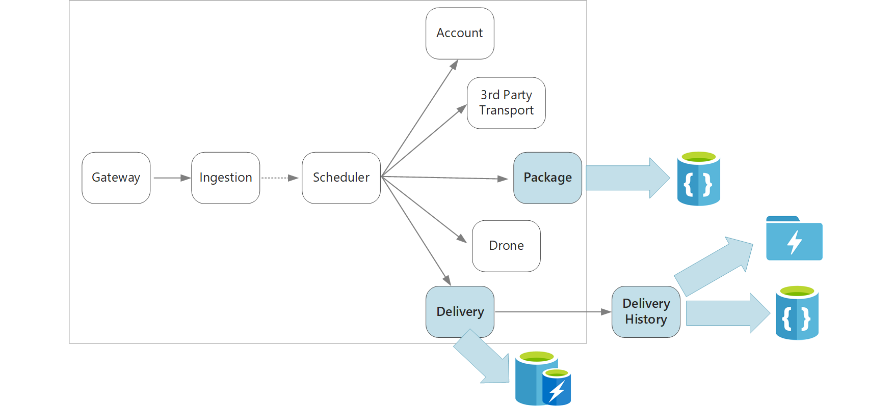

# Data considerations for microservices

This section describes considerations for managing data in a microservices architecture. Some of the main challenges are data integrity, eventual consistency, and master data management.

A basic principle of microservices is that each service manages its own data. Two services should not share a database. A service is responsible for its own private database, which other services cannot access directly.

The reason for this rule is to avoid tight coupling between services. We want every service to be updated and deployed independently, and sharing a database creates a dependency. If there is a change to the data schema, the change must be coordinated across every service that relies on that database. By isolating each service's data store, we can limit the scope of change, and preserve the agility of truly independent deployments.

> It's fine for services to share the same physical database server. The problem occurs when services shared the same schema, or read and write to the same set of database tables.

A second reason to avoid shared databases is that each service may have its own data models, queries, or read/write patterns. Using a shared database would limit each team's ability to optimize data storage for their particular service. 

This approach naturally leads to [polyglot persistence](https://martinfowler.com/bliki/PolyglotPersistence.html) &mdash; the use of multiple data storage technologies within a single application. One service might require the schema-on-read capabilities of a document database. Another might need the referential integrity provided by an RDBMS. Each team is free to make the best choice for their service. For more about the general principle of polyglot persistence, see [Use the best data store for the job](../guide/design-principles/use-the-best-data-store.md). 

## Challenges

Some challenges arise from this distributed approach to managing data. First, there may be redundancy across the data stores, with the same item of data appearing in mulitple places. For example, data might be stored as part of a transaction, then stored elsewhere for analytics, reporting, or archiving. Duplicated or partitioned data can lead to issues of data integrity and consistency. When data relationships span multiple services, you can't use traditional data management techniques to enforce the relationships.

Traditional data modeling uses the rule of "one fact in one place." Every entity appears exactly once in the schema. Other entities may hold references to it but not duplicate it. The obvious advantage to the traditional approach is that updates are made in a single place, which avoids problems with data consistency. In a microservices architecture, you have to consider how updates are propaged across services, and how to manage eventual consistency when data appears in multiple places without strong consistency. 

## Approaches to managing data

There is no single approach that's correct in all cases, but here are some general guidelines for managing data in a microservices architecture.

- Embrace eventual consistency where possible. Understand the places in the system where you need strong consistency or ACID transactions, and the places where eventual consistency is acceptable.

- When you need strong consistency guarantees, one service may represent the source of truth for a given entity, which is exposed through an API. Other services might hold their own copy of the data, or a subset of the data, that is eventually consistent with the master data but not considered the source of truth. For example, imagine a customer order service and a recommendation service. The recommendation service might listen to events from the order service, but if a customer requests a refund, it is the order service, not the recommendation service, that has the complete transaction history.

- For transactions, use patterns such as [Scheduler Agent Supervisor](../patterns/scheduler-agent-supervisor.md) and [Compensating Transaction](../patterns/compensating-transaction.md) to keep data consistent across several services.  You may need to store an additional piece of data that captures the state of a unit of work that spans multiple services, to avoid partial failure among multiple services. For example, keep a work item on a durable queue while a multi-step transaction is in progress. 

- Store only the data that a service needs. A service might only need a subset of information about a domain entity. For example, in the delivery bounded context, we need to know which customer is associated to a particular delivery. But we don't need the customer's billing address &mdash; that's managed by the Accounts bounded context. Thinking carefully about the domain, and using a DDD approach, can help here. 

- Consider whether your services are coherent and loosely coupled. If two services are continually exchaning information with each other, resulting in chatty APIs, you may need to redraw your service boundaries, by merging two services or refactoring their functionality.

- Use an [event driven architecture style](../guide/architecture-styles/event-driven.md). In this archtecture style, a service publishes an event there are changes to its public models or entities. Interested services can subscribe to these events. For example, another service could use the events to construct a materialized view of the data that is more suitable for querying.

- A service that sends events should publish a schema that can be used to automate serializing and deserializing events, to avoid tight coupling between publishers and subscribers. Consider JSON schema or a framework like [Microsoft Bond](https://github.com/Microsoft/bond), Protobuf, or Avro. Think about how you will version the event schema. 
 
- At high scale, events can become a bottleneck on the system, so consider using aggregation or batching to reduce the total load. 

## Data storage in the Drone Delivery application

Even with only a few services, the Shipping bounded context illustrates several of the points discussed in this section. 

When a user schedules a new delivery, the client request includes information about the delivery (pickup and dropoff locations, delivery time) and the packages (size, weight). This information defines a unit of work, which the Ingestion service to Event Hubs. It's important that the unit of work stays in persistent storage while the Scheduler service is executing the workflow. For more discussion of the workflow, see [Ingestion and workflow](./ingestion-workflow.md). 

The various backend services care about different subsets of the information the request, and also have different read and write profiles. 

- The Delivery service stores information about every delivery that is currently scheduled or in progress. It also listens for events from the drones, and updates the status whenever a package is picked up or dropped off.

- The Delivery History service listens for delivery status events from the Delivery service. It stores this data in long-term storage, for the purpose of historical queries and data analytics.

- The Package service stores information about all of the packages.

### Delivery service

It's expected that users will frequently check the status of a delivery while they are waiting for their package. Therefore, the Delivery service requires a data store that emphasizes retrieval speed over long-term storage. Also, the Delivery service does not perform any complex queries or analysis, it simply fetches the latest status for a given delivery. For these reasons, the Delivery service team chose Azure Redis Cache.

### Delivery History service

The Delivery History service has two main functions:

- Enable analysis of the aggregated data, looking for patterns or trends over time, in order to opmitize the business or improve the quality of the service. (The Delivery History service doesn't perform the actual analysis of the data. It's only responsible for the ingestion and storage.)
- Enable users to look up the history of a delivery after the delivery is completed.

These two use-cases have different requirements. The first must be optimized for performing data analysis on a large set of data, using a schema-on-read approach to accomodate a variety of data sources. Azure Data Lake Store is a good fit for this scenario. Data Lake Store is an Apache Hadoop file system compatible with Hadoop Distributed File System (HDFS), and is tuned for performance for data analytics scenarios. 

For optimal performance , Microsoft recommends storing data in Data Lake Stoere in larger sized files (at least 256MB), and organizing time-series data into folders partitioned by date. For more information, see [Tuning Azure Data Lake Store for performance](/azure/data-lake-store/data-lake-store-performance-tuning-guidance). However, that structure is not optimal for looking up individual records by ID. Therefore, the Delivery History service also stores data in Cosmos DB for quicker lookup. Only the fields needed to query the status of a delivery are stored in Cosmos DB. Periodically, older history data can be purged from Cosmos DB. 

### Package service

Finally, the Package service has two basic requirements: 

- High write throughput.
- Simple queries by package ID.

The package data is not relational, so a documented oriented database is appropriate, and Cosmos DB can achieve very high throughput by using sharded collections. The team that works on the Package service is familiar with the MEAN stack (MongoDB, Express.js, AngularJS, and Node.js), so they select the [MongoDB API](/azure/cosmos-db/mongodb-introduction) for Cosmos DB. That lets them leverage their existing experience with MongoDB, while getting the benefits of Cosmos DB.
