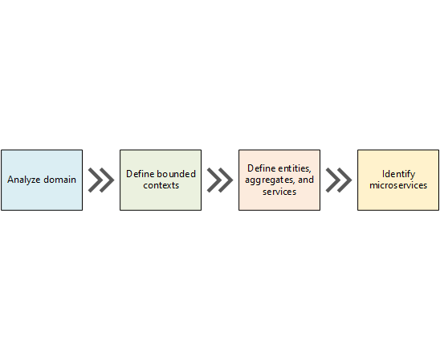
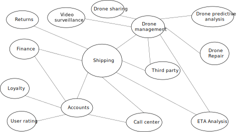

# Apply domain driven design 

When designing microservices, one of the biggest challenges is defining the boundaries of individual services. The general rule is that a service should do "one thing" &mdash; but putting that rule into practice requires careful thought. 

Here are two guiding principles:

- Microservices should be designed around business capabilities, not horizontal layers such as data access or messaging.  
- Microservices should have loose coupling and high functional cohesion. 

Microservices are *loosely coupled* if you can change one service without requiring other services to be updated at the same time. Later in this guidance we will discuss some best practices to keep services decoupled. A microservice is *cohesive* if it has a single, well-defined purpose, such as managing user accounts or tracking delivery history. 

However, there is no mechanical process that will produce the "right" design. You have to think deeply about your business domain, requirements, and goals. Otherwise, you might end up with a hapharzard design that exihibits some undesireable characteristics, such as hidden dependencies between services, tight coupling, or poorly designed interfaces. 

We start by analyzing the business domain to understand the application's functional requirements. The output of this step is an informal description of the domain, which can then be refined into a more formal set of domain models. 

Next, we identify the *bounded contexts* of the domain. Each bounded context will contain its own domain model that represents a particular subdomain of the larger application. 

In the third step, we further refine the domain model by applying a set of DDD *patterns* such as entity, aggregate, and service. Those patterns form the basis for designing a coherent set of microservices.

> [!NOTE]
> This process is iterative and ongoing. A well-designed architecture will evolve over time. Service boundaries aren't fixed in stone. As the application evolves, you may refactor a service into several smaller services. 

## Analyze the domain

Before writing any code, you need a bird's eye view of the entire system that you are creating. Domain driven design (DDD) is an approach to software design that starts by modeling the business domain.  A domain model is an abstract model of the domain. It distills and organizes domain knowledge, and provides a common language for developers and domain experts. 

A domain model must include behaviors and business rules &mdash; it's not just a data schema or an object graph. The domain model is not code. The application code conforms to the model, and expresses the model, but the model is logically separate from the implementation. (However, don't make the mistake of thinking that DDD has to follow a waterfall model, where the domain model is finalized before starting to implement. The domain model should evolve with the application.)

Using a DDD approach will help you to design microservices so way that every service forms a natural fit to a functional business requirement. It can help you to avoid the trap of letting yoru design be dictated by organizational boundaries or technology choices &mdash; say, putting unrelated functionality into the same service simply because they both use a SQL database.

The journey begins with domain analysis. Start by mapping all of the business functions and their connections. This will likely be a collaborative effort that involves domain experts, software engineers, and other stakeholders. You don't need to use any particular formalism.  Sketch a diagram or draw on whiteboard.

As you fill in the diagram, you may start of indentify discrete subdomains. Which functions are closely related? Which functions are core to the business, and which provide ancillary services? What is the dependency graph? 

During this initial phase, you aren't concerned with technologies or implementation details. That said, you should note the place where the application will need to integrate with external systems, such as CRM, payment processing, or billing systems. 

After an initial domain analysis, the team came up with the following rough sketch that depicts the domain.

 

- **Shipping** is placed in the center of the diagram, because it's core to the business. Everything else in the diagram exists to enable this functionality.
- **Drone management** is also core to the business. Functionality that is closely related to drone management include **repairing drones** and using **predictive analysis** to predict when drones need servicing and maintenance. 
- Closely related to shipping, **ETA analysis** provides time estimates for pickup and delivery. **Third-party transportation** will enable the application to schedule alternative transportation methods if the delivery cannot be made entirely via drone.
- **Drone sharing** is a possible extension of the core business. The company may have excess drone capacity during certain hours, and could rent out drones that would otherwise be idle. This feature will not be in v1 of the application.
- Similarly, **video surveillance** is another area that the company might expand into at a later time.
- Support services include **user accounts**, **Call center**, and others.
 
Notice that at this point we have not defined any objects in our design, or made any technology choices.

It's also worth noting that not everything in the diagram will be implemented within the application. For example, invoicing might be an external software system. Third-party transportation and call center are services provided by third parties. Even so, the application needs to interact with these systems and services, so it's important they are part of the domain model. 

> [!NOTE]
> When an application depends on an external system, there is a risk that the external system's data schema or API will leak into your application, ultimately compromising the architectural design. This is particularly true with legacy systems that may not follow modern best practices, and may use convoluted data schemas or obsolete APIs. In that case, it's important to have a well-defined boundary between these external systems and the application. Consider using the [Strangler Pattern](../patterns/strangler.md) or the [Anti-Corruption Layer Pattern](../patterns/anti-corruption-layer.md).

## Define bounded contexts

The domain model will include representations of real things in the world &mdash; users, drones, packages, and so forth. But that doesn't mean that every part of the system needs to use the same representation. 

For example, the parts of the system that handle drone repair and predictive analysis will need to represent many of the physical characteristics of each drone in the fleet, such as maintenance history, mileage, age, model number, performance characteristics, and so on. But when it's time to schedule a delivery, we don't care about those things. The application only needs to know whether a drone is avalable, and the ETA for pickup and delivery. 

If we tried to create a single model for both subsystems, drone repair and deliveries, the model would be unnecessarily complex. In addition, it becomes harder to evolve the model over time, because changes have to satisfy multiple teams working on separate subsystems. Therefore, it's often better to have separate models that represent the same real-world entity (in this case, a drone) in two different contexts. 

This is where the DDD concept of *bounded contexts* comes into play. A bounded context is simply the boundary within a domain where a particular domain model applies. 

Looking at the previous diagram, we can group functionality according to whether functions should share a single domain model. 

 
 
Bounded contexts are not necessarily isolated from one another. The solid lines that connect the bounded contexts represent the places where two bounded contexts interact. For example, Shipping depends on User Accounts to get information about customers, and depends on Drone Management to schedule drones from the fleet.

In the book *Domain Driven Design* (Addison-Wesley, 2003), Eric Evans describes several patterns for maintaining the integrity of a domain model when it interacts with another bounded context. One of the main principles of microservices is that services communicate through well-defined APIs. This approach corresponds to two patterns that Evans calls Open Host Service and Published Language. The idea of Open Host Service is that a subsystem defines a formal protocol (API) that other subsystems use to communicate with it. Published Language extends this idea by publishing the API in a form that other teams can use to write clients. When we start designing our actual microservices, they will expose RESTful APIs that are described using the [OpenAPI Specification](https://www.openapis.org/specification/repo). 

For the rest of this journey, we will focus on the Shipping bounded context. 

Next: [Apply tactical DDD patterns](./tactical-ddd.md)