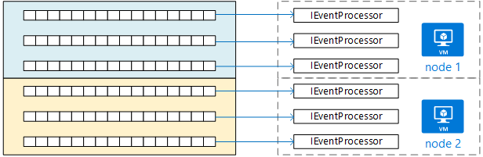

# Ingestion and workflow

In this section, we describe how the Drone Delivery application handles incoming client requests. This involves ingesting the requests at high volume, and then initiating a workflow for each request. The application must be able to service requests in a reliable and efficient manner, including handling failures. 

## The drone delivery workflow

When you decompose and application in microservices, it's common for a single operation to consist of multiple steps that span services. In the Drone Delivery application, scheduling a new delivery requires the following steps:

1. Check the status of the customer's account (Account service).
2. Create a new package entity (Package service).
3. Check whether any third-party transportation is required for this delivery, based on the pickup and delivery locations (Third-party Transportation service).
4. Schedule a drone for pickup (Drone service).
5. Create a new delivery entity (Delivery service).

This is the core of the entire application, so the end-to-end process must be performant as well as reliable. Here are some of the particular challenges that must be addressed:

- **Load leveling**. Too many client requests can overwhelm the system with inter-service network traffic. It can also overwhelm backend dependencies such as storage or remote services. These may react by throttling the services calling them, creating back pressure in the system. Therefore, it's important to load level the requests coming into the system, by putting them into a buffer or queue for processing. 

- **Guaranteed delivery**. To avoid dropping any client requests, the ingestion component must guarantee at-least-once delivery of messages. 

- **Error handling**. If any of the services returns an error code or experiences a non-transient failure, the delivery cannot be scheduled. An error code might indicate an expected error condition (for example, the customer's account is suspended) or an unexpected server error (HTTP 5xx). A service might also be unavailable, causing the network call to time out. 

First we'll look the ingestion side of the equation &mdash; how the system can ingest incoming user requests at high throughput. Then we'll consider how the drone delivery application can implement a reliable workflow. It turns out that the design of the ingestion subsystem affects the workflow backend. 

## Ingestion

Based on business requirements, the development team identified the following non-functional requirements for ingestion:

- Sustained throughput of 10K requests/sec.
- Handle spikes of up to 100K/sec without dropping client requests or timing out.
- Less than 500ms latency in the 99th percentile.

The requirement to handle occasional spikes in traffic presents a design challenge. In theory, the system could be scaled out to handle the maximum expected traffic. However, provisioning that many resources woud be very inefficient. Most of the time, the application will not need that much capacity, so there would be idle cores and excess database resources, costing money without adding value.

A better approach is to put the incoming requests into a buffer, and let the buffer act as a load leveler. With this design, the Delivery Scheduler must be able to the maximum ingestion rate of 100K requests/second over short periods, but the backend services only need to handle the maximum sustained load of 10K. By buffering at the front end, the backend services shouldn't need to handle large spikes in traffic.

At the scale the development team is targeting, Event Hubs is a good choice for load leveling, because of its high ingestion rate. Our tests showed that ingress per event hub was about 32k ops/sec with latency around 90ms. The delivery scheduler is also capable of sharding across more than one event hub. Ingress with 2 event hubs was 45k ops/sec with latency below 100 ms. (As with all performance metrics, there can be multiple factors that affect performance, so don't interpret these numbers as a benchmark.)

It's important to understand how Event Hubs can achieve such high throughput, because that affects how a client should consume messages from Event Hubs. Event Hubs does not implement a *queue*. Rather, it implements an *event stream*. 

With a queue, an individual consumer can remove a message from the queue, and the next consumer will get the next message on the queue. You can use a [Competing Consumers pattern](../patterns/competing-consumers.md) to process messages in parallel and improve scalability. For greater resiliency, the consumer holds a lock on the message and releases the lock when it's done processing the message. If the consumer fails &mdash; for example, the node it's running on crashes &mdash; the lock times out and the message goes back onto the queue. 

Event Hubs, on the other hand, uses streaming semantics. Consumers read the stream independently at their own pace. Each consumer must keep track of its current position in the stream, using a client-side cursor. 

For resiliency, the consumer should record its position by writing the latest offset to a persistent store at some predefined interval. This process is called checkpointing. If the consumer fails, another instance can pick up from the last checkpoint. In that case, some events may be replayed, depending on when the last checkpoint was saved. There is a tradeoff: Frequent checkpoints are slower, but sparse checkpoints mean you will replay more events after a failure. If you don't checkpoint, it's possible to lose messages if a node fails. For some scenarios, you may be able to tolerate some message loss. But in the case of the Delivery Scheduler, each message represents a customer trying to use the drone service, so it's important to avoid lost messages.

 
Event Hubs is not designed for competing consumers. Although multiple consumers can read a stream, each traverses the stream independently. Instead, Event Hubs uses a partitioned consumer pattern. An event hub has up to 32 partitions. Horizontal scale is achieved by assigning a separate consumer to each partition.

What does this mean for the drone delivery workflow? To get the full benefit of Event Hubs, the Delivery Scheduler cannot wait for each message to be processed before moving onto the next. If it does that, it will spend most of its time waiting for network calls to complete. Instead, it needs to process batches of messages in parallel, using asynchronous calls to the backend services. As we'll see, choosing the right checkpointing strategy is also important.  

## Workflow

We looked at three options for reading and processing the messages: Event Processor Host, Service Bus queues, and the IoTHub React library. We chose IoTHub React, but to understand why, it helps to start with Event Processor Host. 

### Event Processor Host

Event Processor Host is designed for message batching. The application implements the `IEventProcessor` interface, and the Processor Host creates one `IEventProcessor` instance for each partition in the event hub. Horizontal scaling is achieved by having each Processor Host instance compete to hold a lease on the available partitions. Over time, partition leases are distributed evenly across Processor Host instances. 

The Event Processor Host calls the application's `IEventProcessor.ProcessEventsAsync` method with batches of event messages. The application controls when to checkpoint inside the `ProcessEventsAsync` method, and the Event Processor Host writes the checkpoints to Azure storage. 

Within a partitition, Event Processor Host waits for `ProcessEventsAsync` to return before calling again with the next batch. This approach simplifies the programming model, because your `IEventProcessor` implementation does not have to be reentrant. However, it also means that the event processor handles one batch at a time, and this gates the speed at which the Processor Host can pump messages.

> [!NOTE] 
> The Processor Host doesn't actually *wait* in the sense of blocking a thread. The `ProcessEventsAsync` method is asynchronous, so the Processor Host can do other work while the method is completing. But it won't deliver another batch of messages from that partition until the method returns. 

In the drone application, a batch of messages can be processed in parallel. But waiting for the whole batch to complete can still cause a bottleneck. Processing can only be as fast as the slowest message within a batch. Any variation in response times can create a "long tail," where a few slow responses drag down the entire system. And in fact, our performance tests showed that we did not achieve our target throughput using this approach. This does *not* mean that you should avoid using Event Processor Host. But for high throughput, avoid doing any long-running tasks inside the `ProcesssEventsAsync` method. Process each batch quickly.

### IotHub React 

[IotHub React](https://github.com/Azure/toketi-iothubreact) is an Akka Streams library for reading events from Event Hub. Akka Streams is a stream-based programming framework that implements the Reactive Streams specification. It provides a way to build efficient streaming pipelines, where all streaming operations are performed asynchronously, and the pipeline gracefully handles backpressure. Back pressure occurs when an event source produces events at a faster rate than the downstream consumers can receive them &mdash; which is exactly the situation when the drone delivery system has a spike in traffic. If backend services go slower, IoTHub React will slow down. If capacity is increased, IoTHub React will push more messages through the pipeline.

Akka Streams is also a very natural programming model for streaming events from Event Hubs. Instead of looping through a batch of events, you define a set of operations on events, and let Akka Streams handle the streaming. 

IoTHub React uses a different checkpoint strategy than Event Host Processor. The checkpoint logic resides in a sink, which is the terminating stage in a pipeline. The design of Akka Streams allows the pipeline to continue streaming data while the sink is writing the checkpoint. That means the upstream processing stages don't need to wait on the checkpoint. You can configure chcekpoint to occur after a timeout or after a certain number of messages have been processed. 
 
Considerations for scaling:

- To make it easier to scale out, each instance of the dispatcher service is assigned a single

- To scale the dispatcher has to be deployed as a statefulsets in kubernetes. Like Deployments, StatefulSets manage Pods that are based on an identical container spec. However, although their specs are the same, the Pods in a StatefulSet are not interchangeable. Each Pod has a persistent identifier that it maintains across any rescheduling. In the case of dispatcher the identifier for the container is the partition id that is assigned to each pod running the workflow. Each pod will execute the messages for its own partition. Pods can overlap on the VM giving a cost effective way to distribute workload in a high density model. This is easy to manage through image updates and deployment cycles. 

- Customers with higher scale requirements than the number of partitions in event hub, can implement a hashing algorithm in the dispatcher and deploy more than one readers per partition pointing to different storage accounts. The result of this configuration is that multiple readers will pick up messages overlapping among them but will only process the messages that belong to them, according to their hashing algorithm.

- Correct sizing of nodes and the right density of them in VMS is important aspect on the dispatcher deployment. The dispatcher is memory and thread bound, because of the akka framework. 

### Service Bus queues

Another option that we considered was to copy messages from Event Hubs into a Service Bus queue, and then have the Scheduler service read the messages from Service Bus. This idea may seem contradictory, given that we had already decided not to use Service Bus for ingestion. However, the idea was to leverage the different strengths of each service: Use Event Hubs to absorb spikes of heavy traffic, while taking advantage of the queue semantics in Service Bus to process the workload, using a competing consumers model. Remember that our target for sustained throughput is less than our expected peak load.
 
With this approach, our proof-of-concept implementation achieved about 4K operations per second. These tests used mock backend services that did not do any real work, but simply added a fixed amount of latency per service. Note that our performance numbers were much less than the theoretical maximum for Service Bus. Possible reasons for the discrepancy include:

- Not having optimal values for various client parameters, such as the connection pool limit, the degree of parallelization, the prefetch count, and the batch size.

- Network I/O bottlenecks.

- Use of PeekLock mode rather than ReceiveAndDelete, which was needed to ensure at-least-once delivery of messages

Further load testing might have discovered the root cause and allowed us to resolve these issues. However, IotHub React met our performance target, so we chose that option.

## Handling failures 

There are three general classes of failure to consider.

1. A downstream service has a transient failure, such as a network timeout. 

2. A downstream service has a non-transient failure. Non-transient failures include normal error conditions, crashes, unhandled exceptions, and so forth. 

3. The Scheduler service faults (for example, a node crashes). 

In the case of a transient failure, the Scheduler service should simply retry the operation. If the operation still fails after a certain number of attempts, it's considered a non-transient failure.  
 
When a non-transient failure occurs, the entire business transaction must be marked as a failure. It may be necessary to undo other steps in the same transaction that already succeeded. 
 
If the Scheduler service itself crashes, Kubernetes will bring up a new instance. However, any transactions that were already in progress must be resumed. 

## Compensating transactions

If a non-transient failure happens, the current transaction might be in a *partially failed* state, where one or more steps already completed successfully. For example, if the Drone service already scheduled a drone, the drone must be canceled.

It then becomes necessary to undo the steps that succeeded, using a [Compensating Transaction](../patterns/compensating-transaction.md). In some cases, this must be done by an external system or even by a manual process. Failures may trigger other actions as well, such as notifying the user by text or email, or sending an alert to an operations dashboard. 

If the logic for compensating transactions is complex, consider creating a separate service that is responsible for this process. In the Drone Delivery application, the Scheduler service puts failed operations onto a dedicated queue, where they can be processed out of band. 

## Idempotent vs non-idempotent operations

In order not to lose any requests, the ingestion service must guarantee that all messages are processed at least once.

- Service Bus Queues can guarantee at-least-once delivery by using PeekLock mode.
- Event Hubs can guarantee at-least-once delivery if the client checkpoints correctly.

If the Scheduler service crashes, it may be in the middle of processing one or more client requests. Those messages will be picked up by another instance of the Scheduler and reprocessed. What happens if a request is processed twice? It's important to avoid duplicating any work. After all, we don't want the system to send two drones for the same package.

One approach is to design all operations to be idempotent. An operation is idempotent if it can be called multiple times without producing additional side-effects after the first call. In other words, a client can invoke the operation once, twice, or many times, and the result will be the same. Essentially, the service should ignore duplicate calls. The HTTP specification states that GET, PUT, and DELETE methods must be idempotent. POST methods are not guaranteed to be idempotent. In particular, if a POST method creates a new resource, there is generally no guarantee that this operation is idempotent. To make a method with side effects idempotent, the service must have a way to detect duplicate calls.

Another option is to track the progress of every transaction in a durable store. Whenever a message is processed, look up the state in the durable store. The [Scheduler Agent Supervisor pattern](../patterns/scheduler-agent-supervisor.md) is one way to implement this approach. However, this approach adds complexity to the workflow logic.
