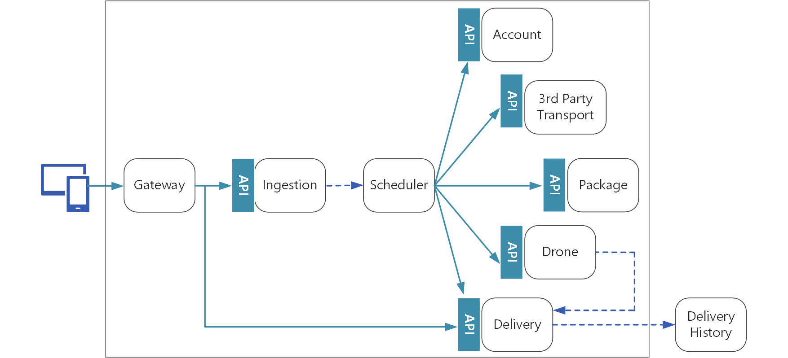
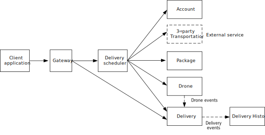

# Interservice communication in microservices

When an application is decomposed into microservices, the problem arises of how one service should talk to another. In this section, we look at the tradeoffs between using asynchronous messaging between services versus calling APIs, and discuss some API design considerations. 

## Synchronous API or asynchronous messaging?

There are two main ways that services can communicate with other services:

- **Synchronously** by calling APIs on the service. 
- **Asynchronously** by sending messages or events.   

There are tradeoffs to each approach. Calling an API is a simple, well-understood paradigm. You call a method, and get a response. However, using asynchronous messages has some advantages that can be very useful in a microservices architecture:

- **Reduced coupling**. The message sender does not need to know about the consumer. 
- **Multiple subscribers**. Using a pub/sub model, multiple consumers can subscribe to receive events. See [Event-driven architecture style](/azure/architecture/guide/architecture-styles/event-driven).
- **Failure isolation**. If the consumer goes down, the sender can still continue to send messages. They will be picked up when the consumer recovers. Synchronous calls can create cascading failures. 
- **Asynchronous operations**. The message sender does not have to wait for the consumer to respond. This is especially useful in a microservices architecture. If there is a chain of service dependencies (service A calls B, which calls C, and so on), waiting on synchronous calls can add unacceptable amounts of latency.
- **Load leveling**. A queue can act as a buffer to level the workload. 
- **Workflows**. Queues can be used to manage a workflow, by check-pointing the message after each step in the workflow.

However, there are also some challenges to using asychronous messaging effectively.

- Using a particular messaging infrastructure may cause tight coupling with that infrastructure. It will be difficult to switch to another messaging infrastructure later.
- The messaging infrastructure incurs additional cost. At high throughputs, the cost could become significant.
- Handling asynchronous messaging is not a trivial task. For example, you must handle duplicated messages, either by de-duplicating or by making operations idempotent. 
- Asynchronous messages don't work well for request-response semantics. 
- If the messages require *queue semantics*, the queue can become a bottleneck in the system. Each message requires at least one queue oepration and one dequeue operation. Moreoever, queue semantics generally require some kind of locking inside the messaging infrastructure. If the queue is a managed service, there may be additional latency, because the queue is external to the cluster’s virtual network. You can mitigate these issues by batching messages, but that complicates the code. If the messages don't require queue semantics, you might be able to use an event *stream* instead of a queue. For more information, see [Event-driven architectural style](../guide/architecture-styles/event-driven.md).  

With these considerations in mind, the Fabrikam team made the following design choices.

- The Delivery Scheduler service exposes a public API. Client applications use this API to schedule, update, or cancel deliveries.
- The backend services (Accounts, Delivery, Package, and Drone Management) expose internal APIs. The Delivery Scheduler service calls these to create or update a delivery request. One reason to use APIs here is that the Delivery Scheduler service requires a response from the downstream services. A failure in any of the downstream services means the entire operation failed. A potential issue is the amount of latency that is introduced by calling the backend services. Later, we'll discuss the workflow in more detail. 
- The Delivery service also exposes some public APIs that are used by clients to get the status of a delivery and to request delivery notification via text or email. Later, we'll see that a gateway can be used to isolate clients from needing to know which service exposes a particular API. 
- While a drone is in flight, the Drone Management service sends events about the drone's current location and status. 
- The Delivery service sends events that describe the status of a delivery, including Created, Rescheduled, InTransit, and DeliveryComplete. Events make it possible for any interested service to subscribe to status updates. In the current design, the Delivery Service is the only subscriber, but it's possible that other services might need to consume these events. For example, they might be used for a dashboard or real-time analytics service. Another reason to use events is that it removes the consumers from the workflow path, meaning the Delivery Scheduler does not have to wait on them.
- The Delivery History service subscribes to the delivery events and stores the history of every delivery. 

Notice that delivery events are derived from drone events. For example, when a drone reaches a delivery location and drops off a package, the Delivery service translates this into a DeliveryCompleted event. This is an example of thinking in terms of domain models. As described earlier, Drone Management belongs in a separate bounded context. The drone events convey the physical location of a drone. The delivery events, on the other hand, represent changes in the status of a delivery, which is a different business entity.
  

## API design for microservices

When you design APIs for a microservice, it's important to distinguish between two types of API:

- A public API that client applications call. 
- Backend APIs that are used for interservice communication.

These two use cases have somewhat different requirements. The public API must be compatible with client applications, typically browser applications or native mobile applications. Most of the time, that means the public API will be REST over HTTP. For the backend APIs, however, you need to take network performance into account. Depending on the granularity of your services, interservice communication can result in a lot of network traffic. Services can quickly become I/O bound. For that reason, considerations such as serialization speed and payload size become more important.

Technology choices. You have to consider several aspects of how an API is implemented:

- **REST or RPC interface**. For a RESTful interface, the most common choice is REST over HTTP using JSON. For an RPC-style interface, there are several popular frameworks, including gRPC, Appache Avro, and Apache Thrift.  

- **Interface definition language (IDL)**. An IDL is used to define the methods, parameters, and return values of an API. An IDL can be used to generate client code, serialiation code, API documentation, or to run automated API tests. Frameworks such as gRPC, Avro, and Thrift define their own IDL specifications. REST over HTTP does not have a standard IDL format, but a common choice is OpenAPI (formerly Swagger). You can also create an HTTP REST API without using a formal defininition language, but then you lose the benefits of code generation and automated testing.

- **Serialization format**. This defines how are objects are serialized over the wire. Options include JSON and XML, which are text-based, or binary formats such as protocol buffer. 

In some cases, you can mix and match options. For example, by default gRPC uses protocol buffers for serialization, but it can use other formats such as JSON.

Considerations:

- Tradeoffs between a REST-style interface or an RPC-style interface.
- Does the serialization format require a fixed schema? If so, do you need to compile a schema file?
- Framework and language support. HTTP is supported in nearly every framework and language. gRPC, Avro, and Thrift all have libraries for C++, C#, Java, and Python. Thrift and gRPC also support Go. 
- Tooling for generating client code, serializer code, API documentation, etc. 
- Serialization efficiency in terms of speed, memory, and payload size.
-  If you are using a service mesh, is the protocol compatible? For example, linkerd has built-in support for gRPC.
- How will you version the APIs and data schemas?
- If you choose a protocol like gRPC, you may need a protocol translation layer between the public API and the back end. A gateway can perform that function.

Our recommendation is to choose REST over HTTP as a baseline, unless you need the performance of a binary protocol. REST over HTTP requires no special libraries. It creates minimal coupling, because callers don't need a client stub to communicate with the service. Finally, it's compatible with browser clients, so you don’t need a protocol translation layer between the client and the backend. However, if you choose this option, you should do performance and load testing early in the development process, to validate whether it performs well enough for your scenario.

## Design RESTful APIs

- Promotes loose coupling between client and server.
- Enforces stateless communication, which improves scalability.
- Defines a uniform interface based on HTTP verbs, which encourages evolvability.

(See [Representational State Transfer (REST)](http://www.ics.uci.edu/~fielding/pubs/dissertation/rest_arch_style.htm) in *Architectural Styles and the Design of Network-based Software Architectures* by Roy Fielding)

In addition, we've seen how making an API resource-oriented maps well to the tactical DDD patterns of aggegates, entities, and value objects. See [Apply tactical DDD concepts](./tactical-ddd.md)

At this point, the principles of REST over HTTP are well-defined. You may find the following topics useful:

[API design](../best-practices/api-design.md) describes general best practices for designing and versioning a REST API. 
[API implementation](../best-practices/api-implementation.md) gives specific recommendations for implementing the API. 

### Asynchronous operations

### Throttling

### Resource conflicts

### Versioning

### OpenAPI documents

<!-- 
•	Give a few examples of best practices (action, error-code, async etc.)
•	Describe some key design decisions (handling Async requests, return 202)
•	Use query string for versioning because our URLs are expected to be stable
•	Use OpenAPI spec to authorize user access
•	Provide OpenAPI (Swagger) document for clients. Please refer to Benefit -> Easy Consumption from here https://pnp.visualstudio.com/_git/DroneDelivery?path=%2FREADME.md&version=GBfeature%2F5842_Delivery_Service_Messaging_choices&_a=preview
•	HATEOAS?
-->

## Service mesh

TBD