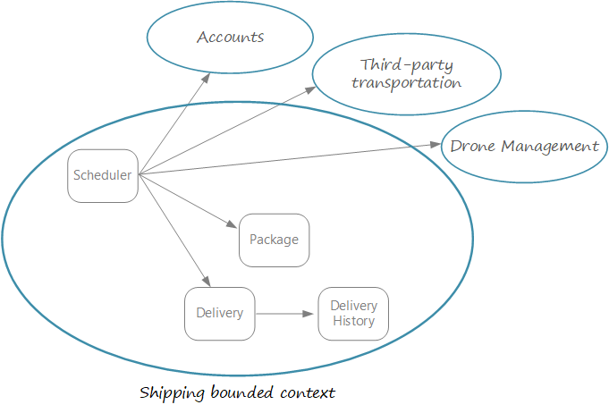

# Apply tactical DDD patterns

Domain driven design has two distinct phases, strategic and tactical. In strategic DDD, you are defining the large-scale structure of the system. Tactical DDD provides a set of design patterns that you can use to create the domain model. In this section, we'll apply the tactical DDD patterns to the Drone Delivery application.

During the strategic phase of DDD, you are mapping out the business domain, defining bounded contexts for your domain models, and developing a ubiquitous language. Tactical DDD is when you define your domain models with more precision. The tactical patterns are applied within a single bounded context. In a microservices architecture, we are particularly interested in the entity and aggregate patterns. Applying these patterns will help us to identify natural boundaries for the services in our application. As a general principle, a microservice should be no smaller than an aggregate, and no larger than a bounded context. First, we'll review the tactical patterns, then we'll apply them to the Shipping bounded context in the drone delivery application.

> [!NOTE]
> This section is not meant to show a complete, comprehensive domain analysis. We have deliberately kept the example brief. However, it illustrates the overall process.  

## Overview of the tactical patterns

If you are already familiar with DDD, you can skip this section. The patterns are described in more detail in *Domain Driven Design* by Eric Evans (see chapters 5 &ndash; 6), and *Implementing Domain-Driven Design* by Vaughn Vernon. This section is only a summary of the patterns.

**Entities**. An entity is an object with a unique identity that persists over time. For example, in a banking application, customers and accounts would be entities. 

- An entity has a unique identifier in the system, which can be used to look up or retrieve the entity. That doesn't mean the identifier is necessarily exposed to users. It could be a GUID or a primary key in a database. The identifier might be a composite key, especially for child entities.
- The attributes of an entity may change over time. For example, a person's name or address might change, but they are still the same person. 
- An identity may span multiple bounded contexts, and may endure beyond the lifetime of the application. 
 
**Value objects**. A value object has no identity. It is defined only by the values of its attributes. Value objects are also immutable. To update a value object, you always create a new instance to replace the old one. Value objects can have methods that encapsulate domain logic, but those methods should have no side-effects on the object's state. Typical examples of value objects include colors, dates and times, and currency values. 

**Aggregates**. An aggregate defines a consistency boundary around one or more entities. Exactly one entity in an aggegrate is the root. Lookup is done using the root entity's identifier. Any other entities in the aggregate are children of the root, and are referenced by following pointers from the root. 

The purpose of an aggregate is to model transactional invariants. Things in the real world have complex webs of relationships. Customers create orders, orders contain products, products have suppliers, and so on. If the application modifies several related objects, how does it guarantee consistency? How do we keep track of invariants and enforce them?  

Traditional applications have often used database transactions to enforce consistency. In a distributed application, however, that's often not be feasible. A single business transaction may span multiple data stores, or may be long running, or may involve third-party services. Ultimately it's up to the application, not the data layer, to enforce the invariants required for the domain. 

> [!NOTE]
> It's actually common for an aggregate to consist of a single entity, with no child entities. Even so, the distinction between aggregates and entities is still important. An aggregate enforces transactional semantics, while an entity might not.

**Domain and application services**. In DDD terminology, a service is an object that implements some logic without holding any state. Evans distinguishes between *domain services*, which encapsulate domain logic, and *application services*, which provide technical functionality, such as user authentication or sending an SMS message. Domain services are often used to model behavior that spans multiple entities. 

> [!NOTE]
> The term *service* is overloaded in computer programming. The definition here is not directly related to microservices.
 
There are a few other DDD patterns not listed here, including factories, repositories, and modules, but these are less relevant for our purposes.

## Define entities and aggregates

We start with the scenarios that the Shipping bounded context must handle.

- A business (the sender) can schedule a drone to deliver a package to a customer (the receiver). Alternatively, a user can request a drone to pick up goods from a business that is registered with the drone delivery service. 
- The sender generates a tag (barcode or RFID) to put on the package. 
- A drone will pick up and deliver a package from the source location to the destination location.
- When a user schedules a delivery, the system provides an ETA based on route information, weather conditions, historical data, and so forth. 
- When the drone is in flight, the sender and the receiver can track the current location and the latest ETA. 
- Until a drone has picked up the package, the user can cancel a delivery.
- When the delivery is complete, the sender and the receiver are notified.
- The sender can request delivery confirmation from the user, in the form of a signature or finger print.
- A user can look up the history of a completed delivery.

From these scenarios, the development team identified the following **entities**.

- Delivery
- Package
- Drone
- Account
- Confirmation
- Notification
- Tag

Of these, Delivery, Package, Drone, and Account are **aggregates**. Tag, Confirmation, and Notification are associated with Delivery entities. The **value objects** in this design include Location, ETA, PackageWeight, and PackageSize. 

The development team also identified an important piece of functionality that doesn't fit neatly into any of the entities or aggregates. Some part of the system must coordinate all of the steps involved in scheduling or updating a delivery. We'll go into more detail in the topic [Ingestion and workflow](./ingestion-workflow.md), but to summarize, the development team decides to implement two **application services**:

- A *Scheduler* that coordinates the steps.
- A *Supervisor* that monitors the status of each step, to detect whether any steps have failed or timed out.

> [!NOTE]
> This is a variation of the [Scheduler Agent Supervisor pattern](../patterns/scheduler-agent-supervisor.md).

## Identify microservices

What is the right size for a microservice? "Not too big and not too small" &mdash; while that's certainly a correct answer, it's not very helpful in practice. We believe that domain-driven design, if you take the time to follow the process, can get you most of the way to a set of well-designed microservices.

1. Start with a bounded context. In general, the functionality in a microservice shouldn't span more than one bounded context. By definition, a bounded context marks the boundary of a particular domain model. If you find that a microservice needs to mix different domain models together, that's an indicator that you may need to go back and refine your domain analysis.

2. Next, look at the aggregates in your domain model. There should be one or more aggregates that have substantial domain logic. (If not, you may need to revisit your domain model.) These aggregates are candidates for microservices. 

    A well-designed aggregate exhibits many of the characteristics of a well-designed microservice:

    - Aggregates are derived from business requirements, rather than technical concerns such as "data access" or "messaging".  
    - An aggregate should have high functional cohesion.
    - Boundaries *across* aggregates should be loosely coupled. 
    - An aggregate is a boundary of persistence.

    Domain services and application services are also good candidates for microservices.

4. Finally, consider non-functional requirements. Look at factors such as team size, data types, technologies used, scalability requirements, availability requirements, and security requirements. These factors may lead you to further decompose a microservice into two or more smaller services, or do the opposite and combine several microservices into one. 

    Here are some reasons to keep functionality within the same service: 
    
    - Communication overhead. If splitting functionality into two services causes them to be overly chatty, it may be a symptom that these functions belong in the same service. 
    - Data consistency and integrity. Microservices maintain their own data stores, and sometimes it's important to maintain data consistency by putting functionality into a single service. That said, consider whether you really need strong consistency. There are strategies for addressing eventual consistency in a distributed system, and the benefits of decomposing 
    
    Here are some reasons to break up a service:
    
    - To keep team sizes small. A team for a single service should probably not be more than a dozen people (the "two-pizza rule").
    - To enable faster release velocity.
    - To limit dependencies.
    - To use different technologies or data stores.

Above all, it's important to be pragmatic, and remember that domain-driven design is an iterative process. When in doubt, start with more coarse-grained microservices. It's much easier to split apart a service later, than it is to refactor functionality across several services in production.
    
## Microservices in the Drone Delivery application

Recall that the development team had identified the following aggregates: Delivery, Package, Drone, and Account. The first two are part of the Shipping bounded context, while Drone and Account belong to other bounded contexts.

- Delivery and Package are obvious candidates for microservices. 

- Drone and Account are interesting because they reside in external bounded contexts. One option is to create Drone and Account microservices that mediate between the Shipping bounded context and the external contexts. Another option is to call directly into those external contexts. The other bounded contexts are outside the scope of this guidance, so we'll treat Done and Account as "placeholders" whose implementation is yet to be determined.

- The Scheduler and Supervisor are both domain services, so it makes sense to implement them as microservices. At this point in the design, it's not clear whether they should be split into separate microservices or kept together.

So far we've considered the aggregates and domain services, but haven't considered non-functional requirements. Thinking about the application's throughput requirements, the development team decides to create a separate Ingestion microservice that is responsible for ingesting client requests. This microservice will implement [load leveling](../patterns/queue-based-load-leveling.md) by putting incoming requests into a buffer for processing. The Scheduler will read the requests from the buffer and execute the workflow.

The following diagram shows the design at this point:
 

